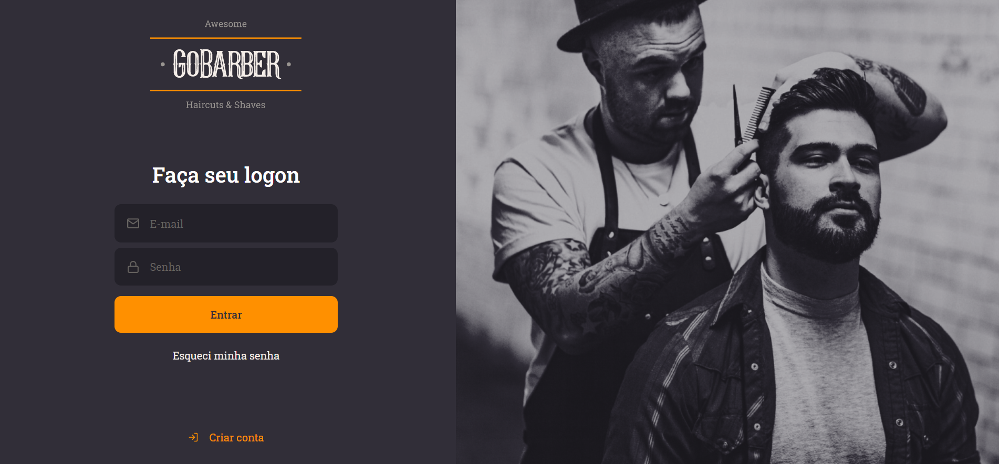

# Gostack 11 Gobarber

#

<space><space>
<space><space>

#

## 💻 Sobre o projeto:

#### Gostack 11: Gobarber

<blockquote>
Gobarber - Gostack11 - Rocketseat: Projeto para desenvolver as habilidades FullStack: React Js, React Native, Node.js e Typescript - Além do domínio de HTML5 e Css.
</blockquote>

## Frontend:

  

 ## 💻 Tecnologias:

   - React Js
   - Node.js
   - Typescript

## :memo: Licença

Esse projeto está sob a licença MIT. 
Veja o arquivo [LICENSE](LICENSE.md) para mais detalhes.

